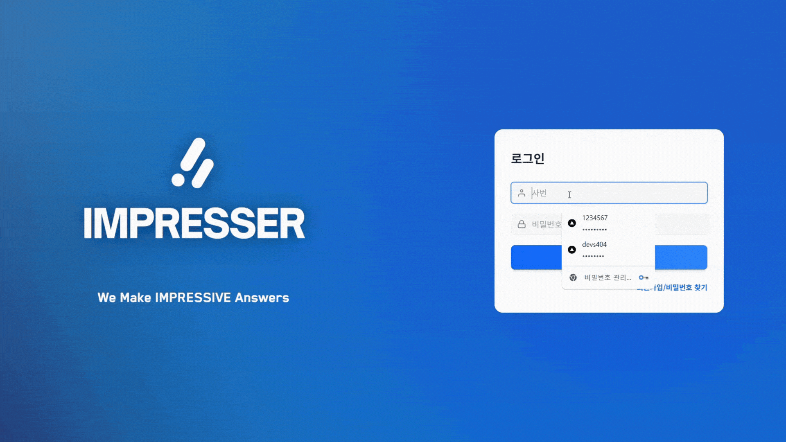
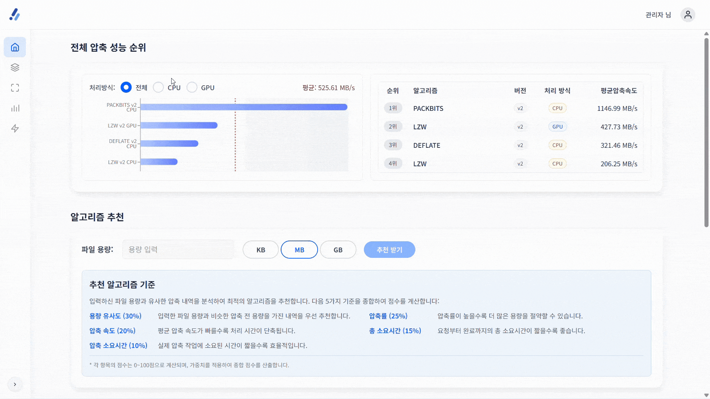
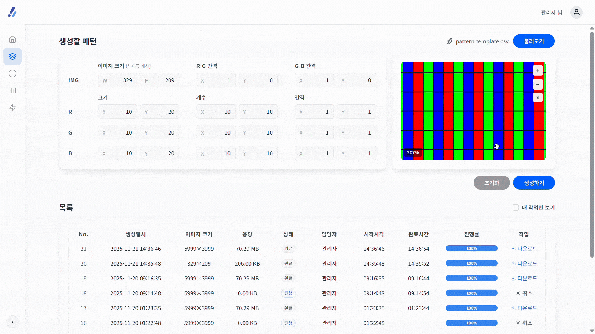
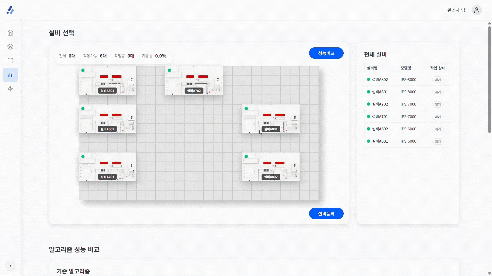
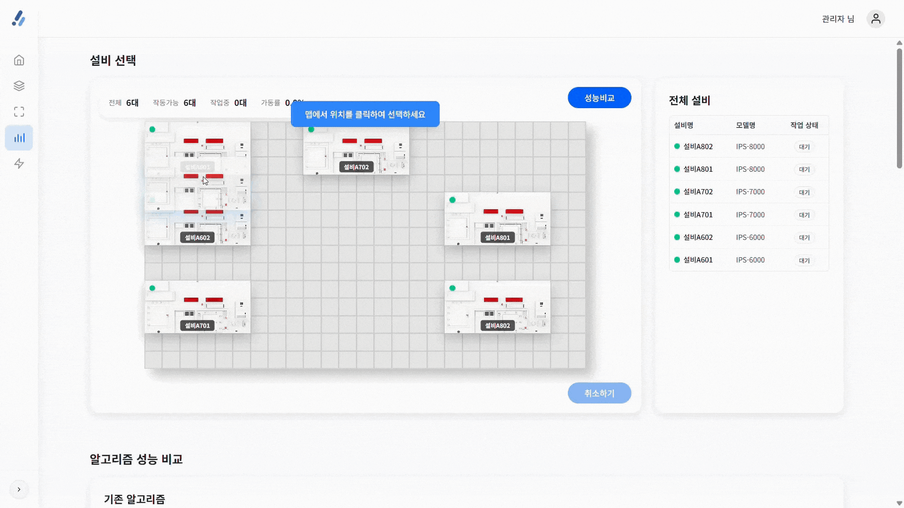
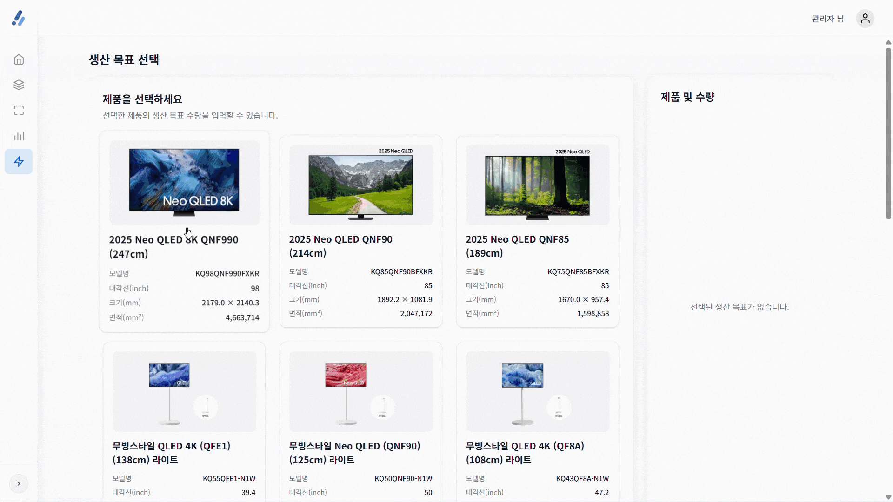
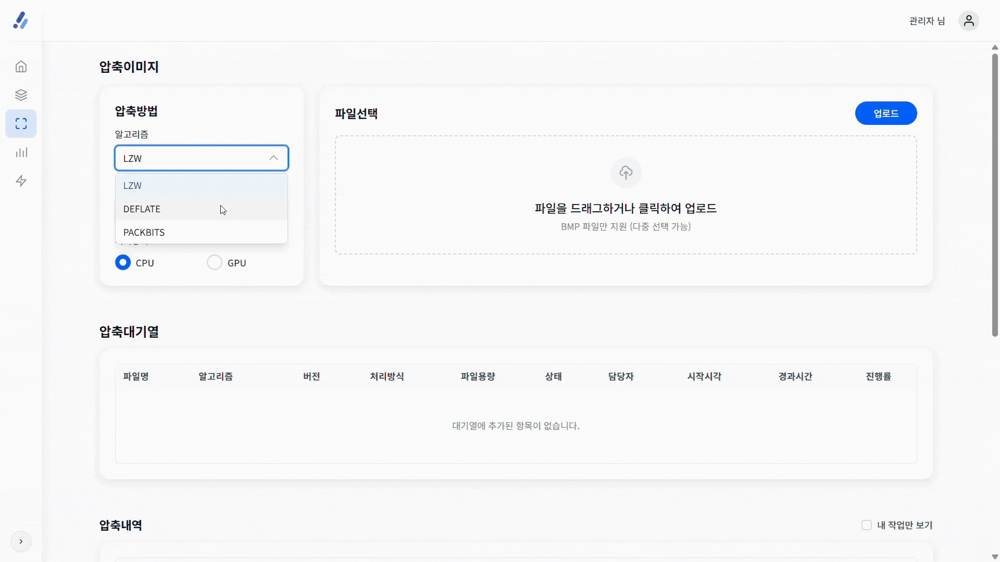
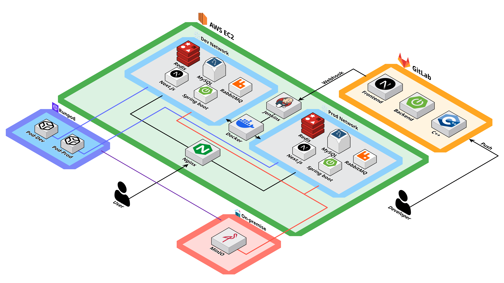
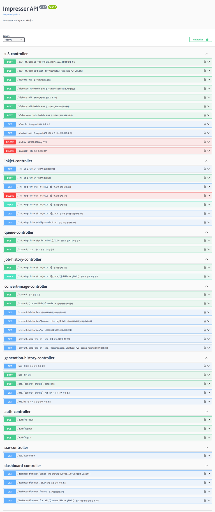
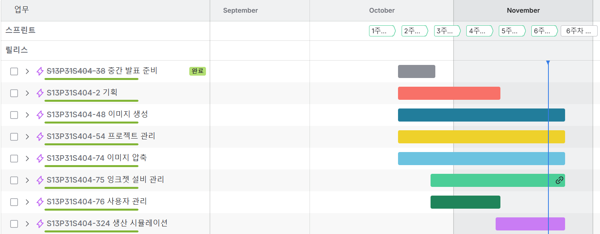

 
  

## impresser
**GPU를 활용한 이미지 가속 압축 SW 개발**

- Samsung Software AI Academy For Youth 13기 자율프로젝트

- 프로젝트 기간 : 2025.10.06 ~ 2025.11.21

- 참여 인원: 5명

 

## 🚀 프로젝트 소개

### 배경
디스플레이 패널 생산에는 RGB 패턴 이미지가 필요하며, 이를 위해 BMP 파일을 TIFF 형식으로 압축해 활용합니다. 하지만 기존 세메스 시스템은 CPU 기반 압축 방식으로 인해 처리 속도와 성능에 한계가 존재합니다

### 목적

GPU 기반으로 고속·고효율 이미지 압축을 수행하는 Impresser 서비스를 개발하여 압축 속도를 개선합니다

### 핵심 대상

제조 장비 소프트웨어 기업

### 특징 / 차별점

⚡ GPU 가속 이미지 압축 (CUDA 기반)

✨ CPU 대비 4배 속도 향상

📬 비동기 압축 대기열 (Queue)

🎨 BMP 패턴 이미지 생성 기능 제

📊 압축 성능 비교 시뮬레이션 제공

 

## 👨‍👩‍👧‍👦 팀원 소개

| 팀원 | 역할 | 담당 업무 |
|:---:|:---:|:---|
| 박지현 | **Frontend design** | 시뮬레이션 화면 구현  성능비교 화면 구현 |
| 윤혜진 | **Frontend design** | 이미지 압축 화면 구현  대시보드 화면 구현  이미지 생성 화면 구현 |
| 김환수 | **Infra Backend** | CI/CD 파이프라인 구축 nvTIFF 라이브러리 기반 이미지 압축 로그인/Security|
| 이희산 | **Backend** | 대시보드 API 구현  CUDA 기반 이미지 생성 기능 구현   S3 이미지 업로드|
| 김나경 | **Backend** | 잉크젯 설비 API 구현  libTIFF 라이브러리 기반 이미지 압축 구현   rabbitMQ 대기열 및 SSE 알림 전송|

 

## 🛠 기술 스택

### Backend  

---
### Image
  
  
  
  
  
  

---
### Frontend  

---

### DevOps / Infra  

---
### Tools  

 

## 📌 주요 기능

 
  <table border="1" cellspacing="0" cellpadding="5" 
         style="border-collapse: collapse; width: 100%; text-align: center; vertical-align: middle;">
    <thead> 
      <tr> 
        <th>로그인</th> 
        <th>대시보드</th> 
      </tr>
    </thead>
    <tbody>
      <tr> 
        <td></td> 
        <td></td> 
      </tr>
      <tr> 
        <th>패턴 생성</th> 
        <th>패턴 생성 미리보기</th> 
      </tr>
      <tr> 
        <td></td> 
        <td></td> 
      </tr>
      <tr> 
        <th>csv 불러오기</th> 
        <th>성능 비교</th> 
      </tr>
      <tr> 
        <td></td> 
        <td></td> 
      </tr>
      <tr> 
        <th>설비 등록</th> 
        <th>생성 시뮬레이션</th> 
      </tr>
      <tr> 
        <td></td> 
        <td></td> 
      </tr>
      <tr> 
        <th>패턴 압축</th> 
      </tr>
      <tr> 
        <td></td> 
      </tr>
    </tbody>
  </table>

 

## 📁 프로젝트 산출물

### [시스템 아키텍처](./readme/Architecture-Diagram.png)
  

### [ERD (Entity Relationship Diagram)](./readme/Entity%20Relationship%20Diagram.png)
  

### [SWAGGER](./readme/swagger-api.png)
  

### [JIRA](./readme/jira.png)
  

### [API 명세서](https://www.notion.so/hwansu/28d8cbba0b6b800da8b9d015a79cd927)

### [기능 명세서](https://www.notion.so/hwansu/28d8cbba0b6b800da8b9d015a79cd927)

### [와이어프레임](https://www.figma.com/design/A5DXhea0ImQ2tgjLCOyNAo/S404?node-id=1613-294&p=f&t=0M6kKRCIeOsxDFzr-0)

### [요구사항 정의서](https://www.notion.so/hwansu/28d8cbba0b6b801a9424c4a100928e5a?v=28d8cbba0b6b80658ecc000c00f8a34e)
